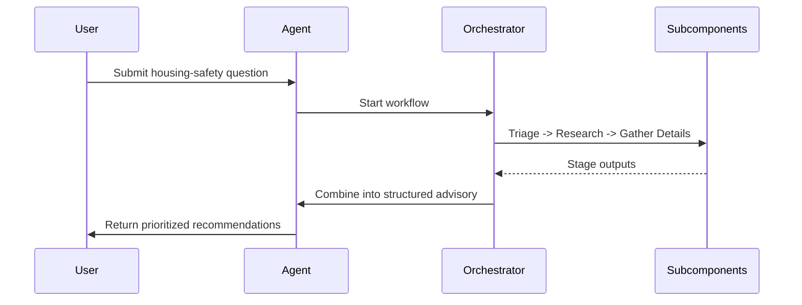
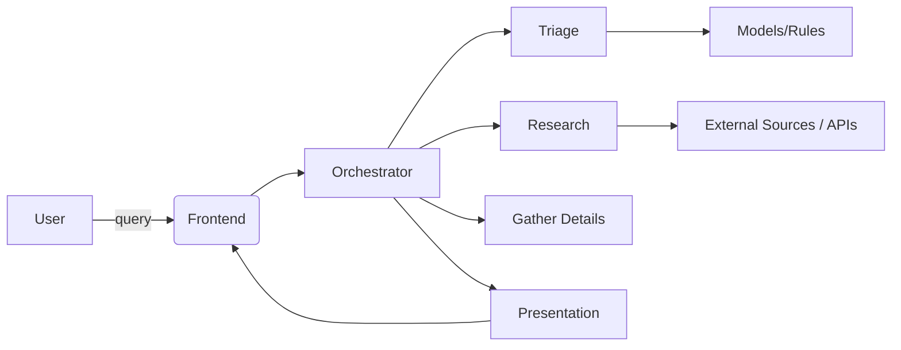

AI Agent — Overview

What is an agent?

An AI agent is a software component that perceives input, reasons about goals, and takes actions to achieve those goals with some degree of autonomy. Agents typically combine:

- a perception layer (accepting user input or environmental data),
- a decision-making or planning component (rules, policies, or models),
- and an action/output layer (responses, API calls, or other effects).

The agent abstraction emphasizes modularity, observable state, and an explicit flow from input → analysis → output, which makes it easy to extend or substitute pieces (for example, swapping a simple rule-based triage for a model-based planner).

What our agent does

This repository implements a Housing Safety Advisory Agent designed to help users evaluate and respond to housing-safety concerns. At a high level the agent:

- Accepts a user query about a housing-safety issue (symptoms, hazards, or general questions).
- Performs a triage step to assess urgency and clarify missing details.
- Runs targeted research or information-gathering steps to assemble relevant guidance, regulations, or resources.
- Gathers any additional contextual details it needs from the user.
- Produces a structured advisory response with recommended next steps, safety priorities, and helpful references.

Architecture and flow

- Orchestrator: `src/core/agent_orchestrator.py` coordinates the workflow and sequences sub-tasks (triage, research, gather details, presentation).
- Subcomponents: modules under `src/core/` (e.g., `triage.py`, `research.py`, `gather_details.py`, `presentation.py`) implement specific capabilities so each stage is testable and replaceable.
- Models & tools: `src/models/` contains data and model interfaces; `src/tools/` and `src/utils/` provide helpers, API calls, and LLM integration utilities.
- Outputs: The agent returns structured results suitable for presentation in the frontend and for programmatic consumption (see `docs/response_schema.json` for the expected shape).

Design goals

- Safety-first: provide clear triage and escalation guidance when issues appear urgent.
- Modular: each stage is separable so logic, prompts, or models can be improved independently.
- Explainable: outputs emphasize rationale and actionable next steps rather than opaque recommendations.

Where to look next

- Orchestrator: [src/core/agent_orchestrator.py](src/core/agent_orchestrator.py)
- Stage implementations: [src/core/triage.py](src/core/triage.py), [src/core/research.py](src/core/research.py), [src/core/presentation.py](src/core/presentation.py)
- Models: [src/models/housing_models.py](src/models/housing_models.py)
- Response schema: [docs/response_schema.json](docs/response_schema.json)

Diagrams

Sequence (high-level flow)

Component diagram

Notes on dialogues

- The agent separates immediate triage (safety/urgency) from non-urgent research so that life-safety guidance is prioritized.
- Responses are structured: Situation → Immediate action → Rationale → Next steps → Resources.
- The agent logs the exchange and stage outputs so follow-up prompts can continue the same context.

Appendix: editing and extending

- To add new behaviors, implement or replace a stage module under `src/core/` and update `src/core/agent_orchestrator.py` to include it in the workflow.
- To change what the agent considers "urgent" modify `triage.py` where risk thresholds and escalation rules live.

Files referenced

- Orchestrator: [src/core/agent_orchestrator.py](src/core/agent_orchestrator.py)
- Stage implementations: [src/core/triage.py](src/core/triage.py), [src/core/research.py](src/core/research.py), [src/core/presentation.py](src/core/presentation.py)
