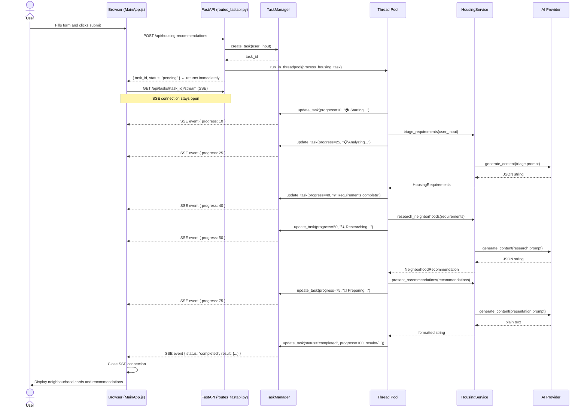
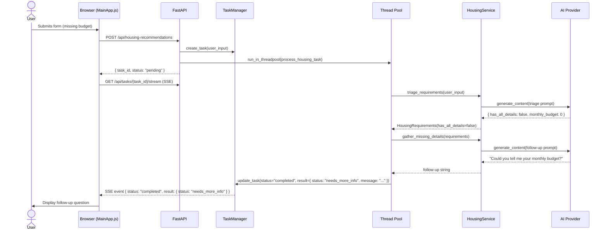
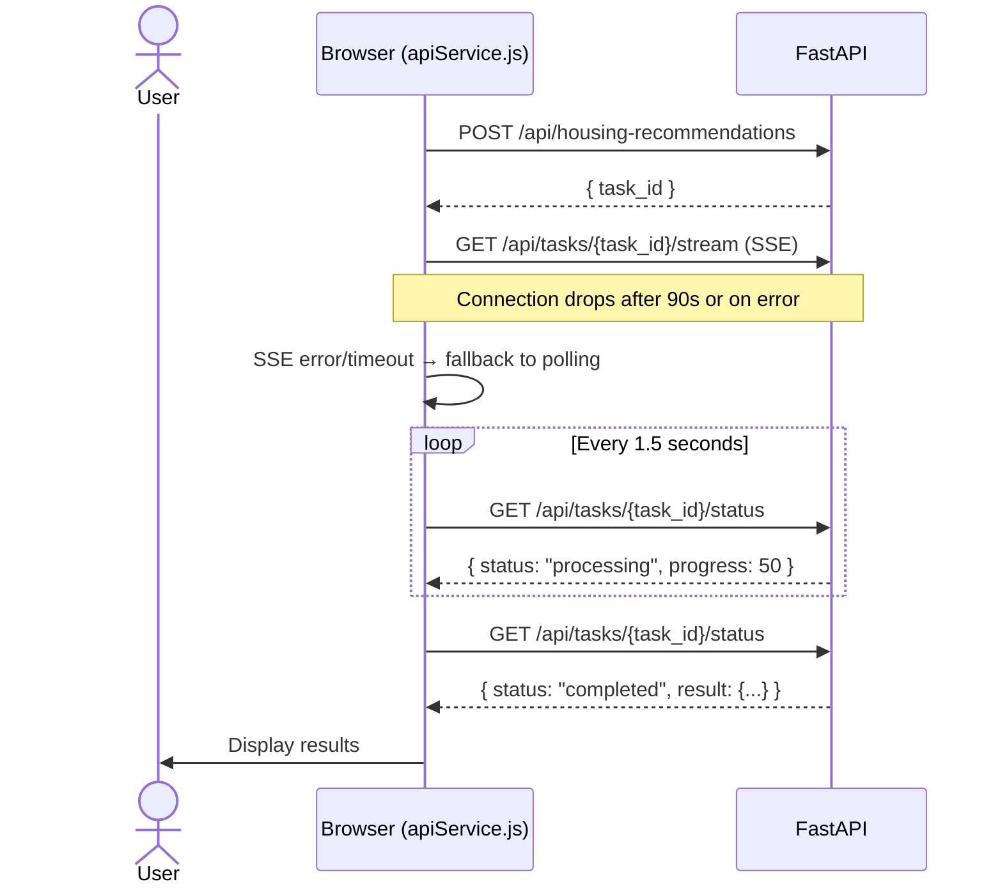
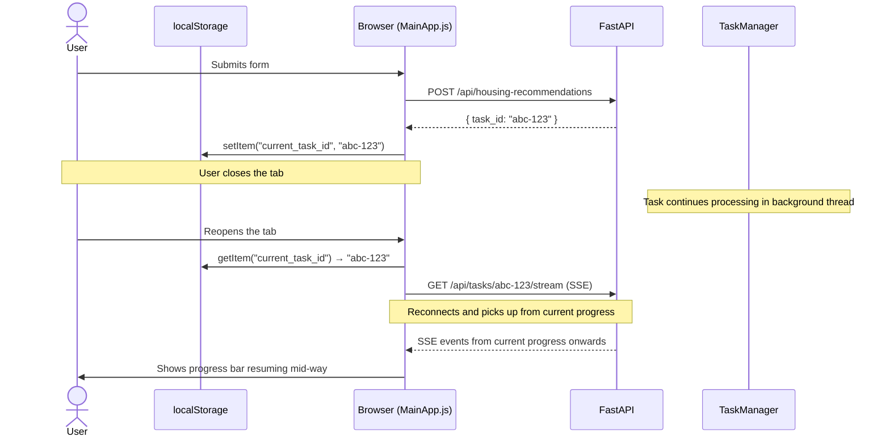
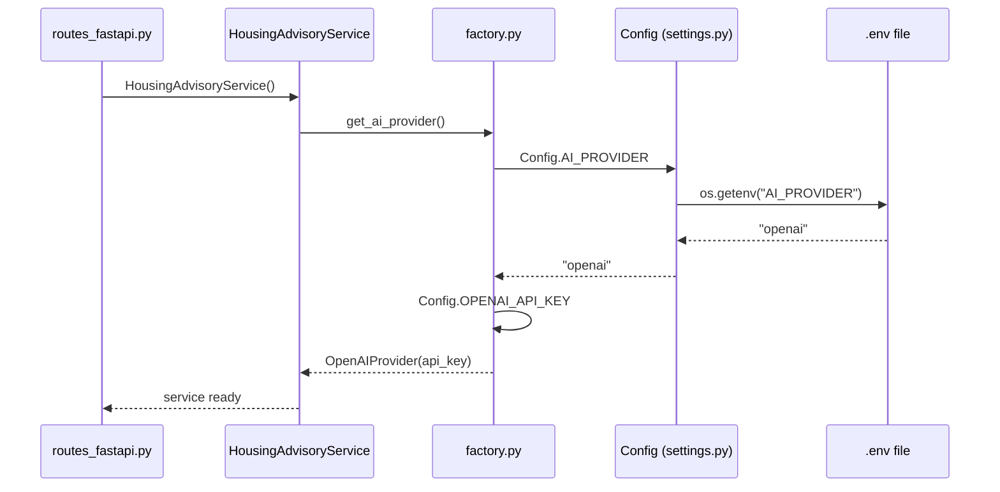

# Sequence Diagrams

This document shows the interaction between every component over time using Mermaid diagrams. These diagrams render automatically in GitHub, GitLab, and most modern documentation tools.

---

## Happy Path — Complete Request

The user submits a form with all required fields. The AI processes it successfully and returns recommendations.

---

## Incomplete Input — needs_more_info Branch

The user submits without all required fields. The flow short-circuits after the first AI call.

---

## SSE Failure — Polling Fallback

The SSE connection drops mid-stream. The frontend falls back to polling.

---

## Resumable Session — Page Reload Mid-Processing

The user closes the tab while the task is still running, then reopens it.

---

## AI Provider Selection at Startup

How the correct AI provider is chosen when the service is first instantiated.

